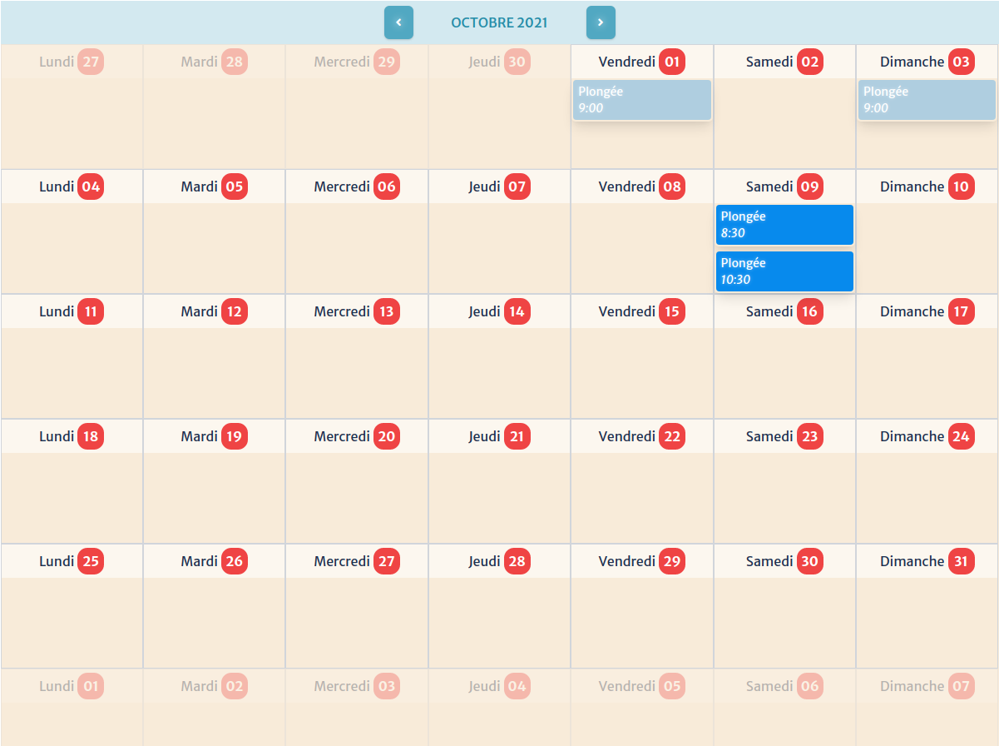

# Calendrier

Le calendrier permet d'afficher les évènements du mois courant. 
Les mois peuvent être défilés pour voir les évènements futurs ou passés.

Vous pouvez y retrouver en détail :

- Le **mois courant**
- La **navigation** (pour aller de mois en mois)
- Le **type** d'évènement (ainsi que son code couleur associé)
- La **date** et **l'heure** de l'évènement

Cliquer sur un évènement du calendrier emmène l'utilisateur sur la fiche complète de l'évènement.

On y retrouve:

- le **détail** de l'évènement
- les **plongeurs** qui y participent
- la partie **inscription**
- l'espace **commentaires**